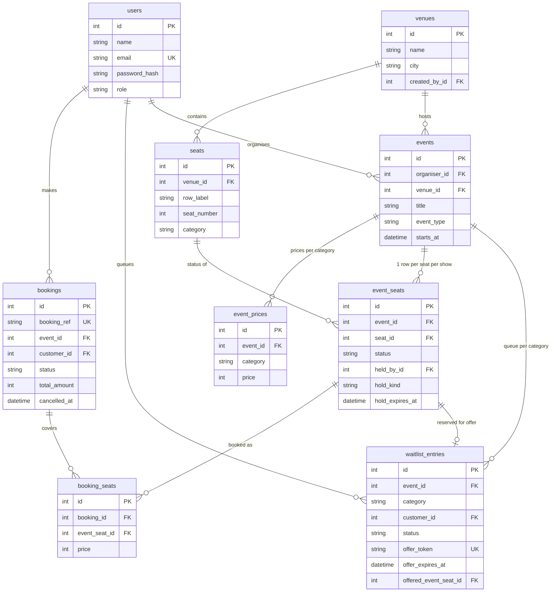

# TicketBox — Ticket Booking System

A ticket booking platform for movies and concerts. Customers book seats from a
live visual seat map, held seats auto-release on checkout abandonment, sold-out
categories have a FIFO waitlist with automatic seat assignment on cancellation,
and every confirmed booking emails a QR-code ticket.

**Stack:** FastAPI (Python) · SQLAlchemy · SQLite (dev) / PostgreSQL (prod) ·
vanilla HTML/CSS/JS frontend · JWT role-based auth · stdlib SMTP + `qrcode`.
One process serves both the API (`/api/*`) and the frontend, so it deploys as
a single free-tier service.

---

## 1. Quick start (local)

```bash
# 1. Python 3.11+ recommended
python -m venv .venv && source .venv/bin/activate   # Windows: .venv\Scripts\activate

# 2. Install dependencies
pip install -r requirements.txt

# 3. Configure (defaults work out of the box)
cp .env.example .env

# 4. Seed demo data (idempotent — safe to re-run)
python seed.py

# 5. Run
uvicorn app.main:app --reload
```

Open **http://localhost:8000** — interactive API docs at
**http://localhost:8000/docs** (FastAPI Swagger UI).

### Demo accounts (password for all: `Demo@1234`)

| Email                    | Role      | Use it to…                                   |
|--------------------------|-----------|----------------------------------------------|
| admin@ticketbox.dev      | admin     | create venues with seat layouts               |
| organiser@ticketbox.dev  | organiser | create events, view booking summary & revenue |
| asha@ticketbox.dev       | customer  | has bookings incl. the sold-out jazz show     |
| ravi@ticketbox.dev       | customer  | holds the other sold-out-show seats           |
| meera@ticketbox.dev      | customer  | fresh account — use to join waitlists         |

### 60-second waitlist demo

1. Log in as **meera** → open *Midnight Jazz Session* (sold out) → **Join waitlist**.
2. Log in as **asha** → My bookings → cancel her jazz booking.
3. Meera instantly receives a time-limited offer email with a claim link
   (in `EMAIL_MODE=console` the email lands in `./outbox/`). Open the link,
   pay (simulated), done. If she waits past the offer TTL, the seat cascades
   to the next person in line automatically.

### Emails without credentials

`EMAIL_MODE=console` (default) prints every email and writes it to `./outbox/`
(body as `.txt`, QR ticket as `.png`), so the full flow is demoable with zero
setup. For real delivery set `EMAIL_MODE=smtp` plus the `SMTP_*` variables —
any free tier works (Brevo, Mailtrap, Gmail app password).

### Run the tests

```bash
python tests/smoke_test.py
```

33 end-to-end checks covering every evaluation focus: role auth, hold
concurrency races, all-or-nothing multi-seat holds, TTL auto-release, booking
+ QR + verification, sold-out waitlist join, cancellation auto-offer, offer
expiry cascading to the next in line, and offer claim. Uses 1-second TTLs
against a throwaway DB, so it finishes in a few seconds.

---

## 2. Environment variables (`.env.example`)

| Variable                     | Default                | Purpose                                            |
|------------------------------|------------------------|----------------------------------------------------|
| `SECRET_KEY`                 | dev value              | JWT signing key — set a long random string in prod |
| `DATABASE_URL`               | `sqlite:///./tbs.db`   | Any SQLAlchemy URL; `postgres://` auto-corrected   |
| `SEAT_HOLD_TTL_SECONDS`      | `600`                  | Checkout hold window (the configurable TTL)        |
| `WAITLIST_OFFER_TTL_SECONDS` | `900`                  | Time-limited waitlist offer window                 |
| `SWEEP_INTERVAL_SECONDS`     | `10`                   | Background sweeper cadence                         |
| `EMAIL_MODE`                 | `console`              | `console` (outbox folder) or `smtp` (real)         |
| `SMTP_HOST/PORT/USER/PASSWORD/EMAIL_FROM` | —         | SMTP relay credentials for `smtp` mode             |
| `BASE_URL`                   | `http://localhost:8000`| Used to build waitlist claim links in emails       |

---

## 3. Deployment (Render — free tier)

The repo ships with `render.yaml` and a `Procfile` (Railway/Heroku-style).

1. Push this folder to a GitHub repo.
2. Render → **New → Blueprint** → pick the repo (it reads `render.yaml`), or
   **New → Web Service** with:
   - Build command: `pip install -r requirements.txt`
   - Start command: `python seed.py && uvicorn app.main:app --host 0.0.0.0 --port $PORT`
3. After the first deploy, set `BASE_URL` to your Render URL (e.g.
   `https://ticketbox.onrender.com`) so waitlist emails link correctly.
4. Optional: attach a Render PostgreSQL instance and set `DATABASE_URL`
   (SQLite on the free tier is ephemeral — data resets on redeploys, fine for
   a demo; Postgres makes it persistent).

---

## 4. API documentation

All endpoints are JSON under `/api`. Auth = `Authorization: Bearer <token>`
header. Live Swagger docs at `/docs`.

### Auth
| Method | Path                 | Role   | Body / notes                                   |
|--------|----------------------|--------|------------------------------------------------|
| POST   | `/api/auth/register` | public | `{name, email, password, role: customer\|organiser}` → `{token, user}` |
| POST   | `/api/auth/login`    | public | `{email, password}` → `{token, user}`          |
| GET    | `/api/auth/me`       | any    | current profile                                |

### Venues (admin creates; organisers read)
| Method | Path                | Role            | Body / notes |
|--------|---------------------|-----------------|--------------|
| POST   | `/api/admin/venues` | admin           | `{name, city, blocks: [{category, rows, seats_per_row}]}` — rows auto-labelled A, B, C… |
| GET    | `/api/venues`       | organiser/admin | list with categories + seat counts |
| GET    | `/api/venues/{id}`  | organiser/admin | one venue's detail |

### Events
| Method | Path                              | Role            | Body / notes |
|--------|-----------------------------------|-----------------|--------------|
| GET    | `/api/events?type=&date=&q=`      | public          | browse upcoming, filter by `movie\|concert`, `YYYY-MM-DD`, title search |
| GET    | `/api/events/{id}`                | public          | detail + per-category price/availability/`sold_out` |
| GET    | `/api/events/{id}/seatmap`        | public*         | rows of per-seat status; *with auth, your held seats are flagged `mine` + expiry. Polled by the UI every 5 s |
| POST   | `/api/events`                     | organiser       | `{venue_id, title, event_type, starts_at, description, prices:{category: ₹}}` — materialises one `event_seats` row per physical seat |
| GET    | `/api/organiser/events`           | organiser       | my events |
| GET    | `/api/organiser/events/{id}/summary` | organiser    | bookings, tickets sold, cancellations, **revenue**, per-category occupancy |

### Seat holds (checkout step 1)
| Method | Path                          | Role     | Body / notes |
|--------|-------------------------------|----------|--------------|
| POST   | `/api/events/{id}/holds`      | customer | `{seat_ids: [event_seat ids]}` → `{held_seat_ids, hold_expires_at}`. **409** with `unavailable_seat_ids` if any seat was just taken (all-or-nothing) |
| DELETE | `/api/events/{id}/holds`      | customer | release my checkout holds early |

### Bookings
| Method | Path                             | Role            | Body / notes |
|--------|----------------------------------|-----------------|--------------|
| POST   | `/api/bookings`                  | customer        | `{event_id, seat_ids}` — converts **my live holds** into a confirmed booking; emails QR ticket. 409 if a hold expired |
| GET    | `/api/me/bookings`               | any (own)       | booking history |
| POST   | `/api/bookings/{id}/cancel`      | owner           | cancels; each freed seat is auto-offered to the waitlist. Returns `waitlist_offers_sent` |
| GET    | `/api/bookings/{id}/qr`          | owner           | PNG QR (encodes `booking_ref`) |
| GET    | `/api/verify/{booking_ref}`      | organiser/admin | gate check for scanned QR → validity + seats + customer |

### Waitlist
| Method | Path                                   | Role     | Body / notes |
|--------|----------------------------------------|----------|--------------|
| POST   | `/api/events/{id}/waitlist`            | customer | `{category}` — only when that category is sold out; returns queue `position` |
| GET    | `/api/me/waitlist`                     | customer | my entries with live position / offer token |
| DELETE | `/api/waitlist/{entry_id}`             | customer | leave the queue (a live offer's seat rolls to the next person) |
| GET    | `/api/waitlist/offer/{token}`          | customer (offer owner) | offer details + expiry (410 if lapsed) |
| POST   | `/api/waitlist/offer/{token}/confirm`  | customer (offer owner) | book the reserved seat before the timer ends |

---

## 5. Database schema



Key constraints: `UNIQUE(event_id, seat_id)` on `event_seats` (exactly one
status row per seat per show), `UNIQUE(venue_id, row_label, seat_number)` on
`seats`, unique `booking_ref` and `offer_token`. Prices are whole INR integers.
Historical bookings keep their `booking_seats` rows after cancellation, so
revenue and history survive seat recycling.

## 6. Seat hold & TTL logic (summary)

- Selecting seats calls `POST /holds`, which flips each seat
  `available → held` with `hold_expires_at = now + SEAT_HOLD_TTL_SECONDS` via
  an **atomic conditional UPDATE** — the WHERE clause only matches seats that
  are available *or* carry an expired hold, so two customers can never both
  succeed (the loser gets rowcount 0 → 409, and the whole multi-seat request
  rolls back).
- Expiry is enforced **twice**: lazily (every read/write treats
  `hold_expires_at <= now` as available) and actively (an in-process asyncio
  **sweeper** runs every `SWEEP_INTERVAL_SECONDS`, releasing lapsed holds so
  the polled seat map frees up in near real time). Correctness never depends
  on the timer; the timer just makes it live.
- `POST /bookings` re-runs the same compare-and-set requiring
  `status='held' AND held_by=me AND not expired`, so an expired or stolen hold
  can never be paid for.

## 7. Waitlist logic (summary)

- Joining is allowed only when the category is sold out; the queue is strict
  FIFO per (event, category).
- On cancellation, each freed seat is immediately re-held for the queue head
  (`hold_kind='waitlist_offer'`), the entry gets a secret `offer_token` +
  `offer_expires_at`, and an email with the claim link goes out.
- The claim link opens a countdown page; confirming reuses the same
  hold→booking compare-and-set. If the timer lapses, the sweeper marks the
  entry `expired` and **cascades the same seat to the next person in line**
  (fresh offer + email); with an empty queue the seat returns to open sale.

A deeper narrative of both mechanisms is in **DESIGN.md** (the ≤800-word
system design write-up).

## 8. Project structure

```
app/
  main.py            FastAPI app, sweeper lifespan, static frontend mount
  config.py          env-driven settings (TTLs, DB, email, secrets)
  database.py        engine/session, naive-UTC helper
  models.py          schema (see §5) + status constants
  schemas.py         request validation (Pydantic)
  auth.py            PBKDF2 password hashing, JWT, role dependencies
  routers/           auth · admin venues · events/seatmap/summary ·
                     holds · bookings/QR/verify · waitlist/offers
  services/
    seat_service.py      holds, conditional-UPDATE concurrency, booking, cancel
    waitlist_service.py  FIFO offers, expiry cascade, queue position
    sweeper.py           background TTL enforcement loop
    email_service.py     console/SMTP delivery + templates
    qr_service.py        booking-ref → PNG QR
frontend/            static pages: browse, seat map + checkout, bookings/QR,
                     claim, organiser dashboard, admin venue builder
seed.py              idempotent demo data (incl. a sold-out show)
tests/smoke_test.py  33-check end-to-end suite
```

## 9. Notes & assumptions

- Payment is simulated (out of scope per the brief); the "Pay" button confirms
  the booking directly.
- The admin account is seed-only by design — customers/organisers self-register.
- Event times are stored as naive venue-local datetimes for simplicity.
- Revenue counts confirmed bookings only (cancellations are treated as refunded).
- Real-time seat map uses 5-second polling with server-time-synced countdowns;
  the design write-up covers why (and the WebSocket upgrade path).
